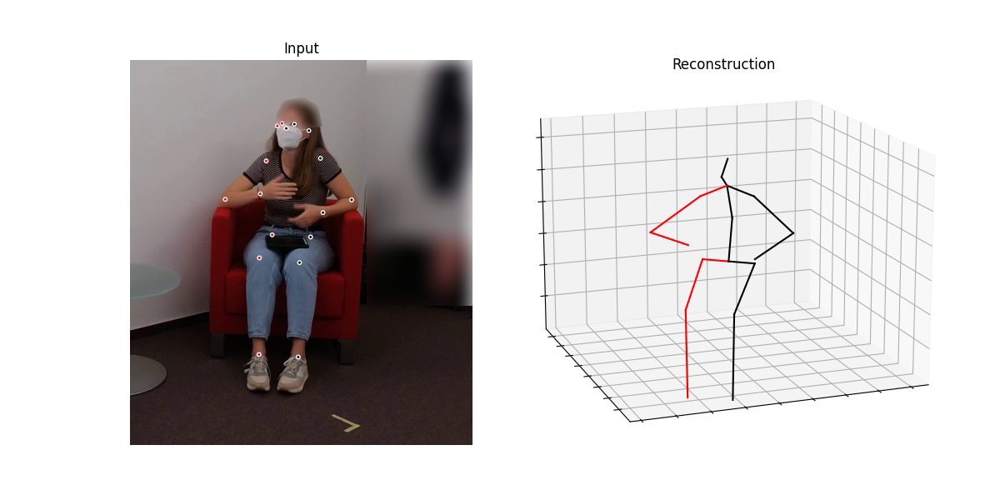

# VP3Dtools
Scripts and tools for the usage of [VideoPose3D](https://github.com/facebookresearch/VideoPose3D)

*Note*: Upper head and side blurred for anonymity. The dots in the left picture indicate the 2D-coordinates extracted with Detectron2, which VideoPose3D builds upon. On the right side, the extracted body points are visualized in 3D space.

# Installation of VideoPose3D
In order to install VideoPose3D according to the installation instructions [`VideoPose3D installation.txt`](https://github.com/c-hoffmann/VP3Dtools/blob/main/VideoPose3D_installation.txt), a system with Ubuntu Linux as well as a high-end NVIDIA GPU is required

## Affilliation
* The author of this repo is the operator of the [Interaction lab](https://www.uniklinik-freiburg.de/psychosomatik/sektionen/systemische-gesundheitsforschung/interaktionslabor.html) of the [Department of Psychosomatic Medicine and Psychotherapy](https://www.uniklinik-freiburg.de/psychosomatik.html) of the [Medical Center](https://www.uniklinik-freiburg.de/), [University of Freiburg](https://uni-freiburg.de/), Germany
